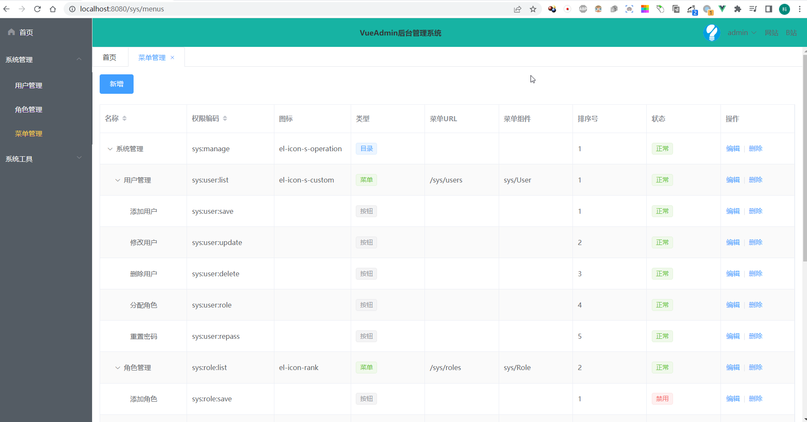
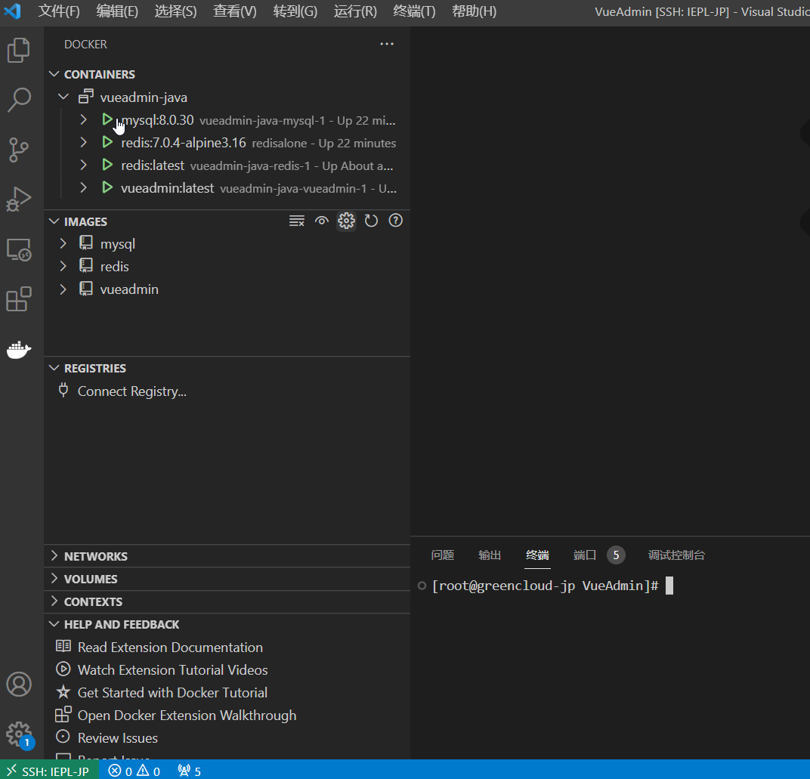

### VueAdmin - 基于SpringBoot+Jwt+Vue的前后端分离后台管理系统

---

### 技术栈：
springboot、spring security、myabtis plus、jwt、vue、element-ui

完整教学！从0到1开发，手把手教你学会开发一个spring security + jwt + vue的前后端分离项目！

线上体验：[https://www.markerhub.com/vueadmin/](https://www.markerhub.com/vueadmin/)

----

### 说明：

项目文档：
* 前端笔记：https://shimo.im/docs/pxwyJHgqcWjWkTKX/ 
* 后端笔记：https://shimo.im/docs/OnZDwoxFFL8bnP1c/

更多项目：[https://www.markerhub.com/](https://www.markerhub.com/)


----

### 项目截图


)


---

### Centos7.9安装MySQL客户端

```bash
yum install mysql-community-client.x86_64 -y

# 连接到数据库
mysql -h 127.0.0.1 -P 3306 -u root -p

docker-compose -f filename up -d
```

